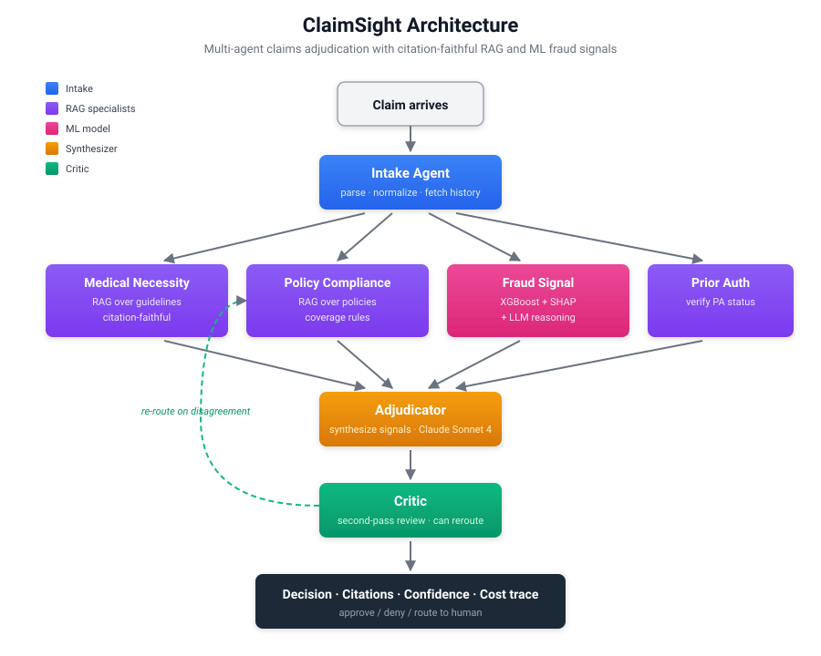

<div align="center">

# 🩺 ClaimSight

**Production-shaped agentic claims adjudication for health insurance.**

*A multi-agent system that reviews healthcare claims, cites the policies and clinical guidelines behind every decision, and is built with the evaluation rigor a real production system would need.*

[](https://www.python.org/downloads/)
[](LICENSE)
[](https://github.com/psf/black)
[](https://github.com/astral-sh/ruff)
[](docs/MASTER_PLAN.md)

[**Try the demo →**](#-try-it-now-no-api-keys-required) ·
[Architecture](#architecture) ·
[Roadmap](docs/MASTER_PLAN.md) ·
[ADRs](docs/adr/) ·
[Setup](docs/SETUP.md)

</div>

---

## ⚡ Try it now — no API keys required

Three commands. No database, no API keys, no SynPUF download. The demo ships with built-in synthetic claims and a deterministic mock LLM so you can see the system run end-to-end before deciding whether to plug in real models.

```bash
git clone https://github.com/jeetsswadia/claimsight.git
cd claimsight
pip install -e .
python scripts/demo.py
```

Add `GROQ_API_KEY` to a `.env` file ([free tier](https://console.groq.com/)) and the same command runs against a real LLM. The contract is identical — only the model behind the call changes.

### What you'll see

```
────────────────────── ClaimSight Demo — knee-mri ──────────────────────
MRI of knee for chronic pain after conservative treatment failure

╭───────────── Claim Packet ─────────────╮
│  Procedure         73721 — MRI knee    │
│  Primary diagnosis M17.11 — OA, right  │
│  Billed amount     $1,450.00           │
│  History (recent)  • Office visit      │
│                    • Physical therapy  │
│                    • Office visit      │
╰────────────────────────────────────────╯

╭──── Medical Necessity Agent  (✓ APPROVE) ────╮
│  Decision     ✓ APPROVE                       │
│  Confidence   88%                             │
│  Rationale    Patient has documented OA with  │
│               prior physical therapy and      │
│               office visits over 6+ weeks,    │
│               consistent with conservative    │
│               therapy failure...              │
│  Citations    2 chunk(s) cited                │
│  chunk 101    "conservative management ...    │
│               at least 6 weeks has failed"    │
│  chunk 102    "advanced imaging is generally  │
│               reserved for cases where..."    │
╰───────────────────────────────────────────────╯
```

### Three scenarios bundled

```bash
python scripts/demo.py --list                # show all scenarios
python scripts/demo.py --claim knee-mri      # routine approval
python scripts/demo.py --claim cosmetic      # clear denial (Z41.1 exclusion)
python scripts/demo.py --claim ambiguous     # routes to human review
```

Each scenario is hand-crafted to exercise a different decision path. Citations link back to specific guideline chunks — you can trace every decision to the exact text that justified it.

---

## What is ClaimSight?

ClaimSight ingests a healthcare claim and runs it through a coordinated set of specialist LLM agents — medical necessity review, policy compliance, fraud detection, prior authorization — to produce an adjudication recommendation with full citations to the policy documents and clinical guidelines that justify the decision.

**Built on synthetic CMS data. No PHI, ever.**

This is a portfolio project, not a product. It is production-*shaped* — built the way a production system would be structured, with the eval rigor a real one would need — but not production-*ready*.

## Why this exists

Healthcare claims adjudication today is mostly humans reading PDFs and looking things up across three different systems. The tooling that does exist is either rule-based and brittle, or LLM-based and untrustworthy because it cannot cite its sources. ClaimSight is an attempt to show what an evaluation-driven agentic system for this problem could look like — and to demonstrate the engineering practices that would make such a system trustworthy.

## What this project demonstrates

Concrete capabilities, each verifiable by browsing the code:

| Capability | Where to look |
|---|---|
| **Multi-agent system design** beyond toy demos | [`src/agents/`](src/agents/), [ADR-0001](docs/adr/0001-use-langgraph-for-orchestration.md) |
| **Citation-faithful RAG** with provenance tracking | [`src/agents/medical_necessity.py`](src/agents/medical_necessity.py) — the `review()` function matches LLM citations back to retrieved chunks |
| **Cost-aware LLM routing** (cheap vs. smart tiers) | [`src/agents/llm_router.py`](src/agents/llm_router.py), [ADR-0002](docs/adr/0002-two-tier-llm-strategy.md) |
| **Production database design** with vector + relational + traces in one store | [`scripts/02_apply_schema.sql`](scripts/02_apply_schema.sql), [ADR-0003](docs/adr/0003-postgres-pgvector-single-store.md) |
| **Hard data integrity boundaries** (synthetic only, no PHI) | [ADR-0004](docs/adr/0004-synthetic-data-only.md) |
| **Engineering hygiene** — CI, ADRs, pre-commit, conventional commits | [`.github/workflows/ci.yml`](.github/workflows/ci.yml), [`docs/adr/`](docs/adr/), commit history |
| **Graceful degradation** — every external dep has a fallback | LLM router falls back to mock when keys are missing; SynPUF script falls back to Synthea |

## Architecture

<p align="center">
  
</p>

For architectural decisions and tradeoffs, see [docs/adr/](docs/adr/) — four ADRs covering the orchestration choice, the two-tier LLM strategy, the single-database decision, and the synthetic-data-only commitment.

## Tech stack

| Concern | Choice | Why |
|---|---|---|
| Orchestration | [LangGraph](https://langchain-ai.github.io/langgraph/) | Standard, fast iteration |
| Cheap LLM | Groq Llama-3.3-70B | Free tier, fast specialists |
| Smart LLM | Claude Sonnet 4 | Adjudicator + critic only |
| Vector DB | pgvector on Supabase | One database, no extra service |
| Fraud model | XGBoost + SHAP | Calibrated, interpretable |
| Eval | [Ragas](https://github.com/explodinggradients/ragas) + custom harness | Per-agent and end-to-end |
| Observability | [Langfuse](https://langfuse.com/) | Full traces, free tier |
| Backend | FastAPI on [Modal](https://modal.com/) | Free tier, fast cold starts |
| Frontend | Next.js on Vercel | Free tier |

## What's working today

| Component | Status |
|---|---|
| Pydantic schemas for the full pipeline | ✅ |
| Postgres + pgvector schema | ✅ |
| Code lookups (CPT, ICD-10, NPI) | ✅ |
| Member history retrieval | ✅ |
| Deterministic intake agent | ✅ |
| Two-tier LLM router with mock fallback | ✅ |
| Medical necessity agent (real LLM, real citations) | ✅ |
| End-to-end demo script with 3 scenarios | ✅ |
| Policy compliance agent | ⚪ Week 2 |
| Fraud signal agent (XGBoost + LLM) | ⚪ Week 4 |
| Adjudicator + critic | ⚪ Week 5 |
| Eval harness | ⚪ Week 6 |
| Web UI | ⚪ Week 7 |
| Live deployment | ⚪ Week 8 |

## Repository layout

```
claimsight/
├── docs/                 # Architecture decisions, setup guide, weekly retros
│   ├── MASTER_PLAN.md    # Full 12-week roadmap
│   ├── WEEK_1_PLAN.md    # Day-by-day for week 1
│   ├── SETUP.md          # Detailed setup walkthrough
│   ├── adr/              # Architecture Decision Records
│   └── diagrams/         # SVG architecture diagrams
├── scripts/
│   ├── demo.py           # ⭐ End-to-end demo, no DB or keys required
│   ├── 00_verify_env.py  # Environment health check
│   ├── 01_download_synpuf.py
│   └── 02_apply_schema.sql
├── src/
│   ├── agents/           # Intake, medical necessity, llm_router
│   ├── data/             # Code lookups, member history
│   ├── db/               # Connection management
│   ├── models/           # Pydantic schemas
│   ├── evals/            # (Week 6)
│   └── api/              # (Week 7)
├── tests/
└── notebooks/
```

## Setup

For just running the demo, the three lines under [Try it now](#-try-it-now-no-api-keys-required) are all you need.

For full development setup (database, all agents, full deps) see [docs/SETUP.md](docs/SETUP.md).

## Roadmap

| Week | Focus | Status |
|---|---|---|
| 1 | Data foundation + intake + first LLM agent | 🟢 In progress |
| 2 | Specialist agent suite (policy, prior auth) | ⚪ |
| 3 | Retrieval pipeline + real corpus | ⚪ |
| 4 | Fraud detection model | ⚪ |
| 5 | Adjudicator + critic loop | ⚪ |
| 6 | Eval harness v1 | ⚪ |
| 7 | Frontend | ⚪ |
| 8 | Deployment | ⚪ |
| 9-10 | Eval iteration + writeup | ⚪ |
| 11 | Polish + launch | ⚪ |
| 12 | Iterate on feedback | ⚪ |

## Eval results

| Metric | Baseline | Current |
|---|---|---|
| Adjudication agreement (vs. ground truth) | TBD | TBD |
| Citation faithfulness | TBD | TBD |
| Hallucination rate (sampled, n=100) | TBD | TBD |
| Cost per claim (USD) | TBD | TBD |
| P50 / P95 latency (s) | TBD | TBD |

Populated with real numbers as the system matures. Methodology is documented as it's built; nothing here is fabricated.

## Live demo

🔗 *Coming end of Week 8. The CLI demo above is the current proof-of-life.*

## Writeup

📖 *Coming end of Week 11. Topic: Building Production Agentic Systems for Healthcare — Evals, Failure Modes, and the Honest Tradeoffs.*

## Contributing

Issues and discussions are welcome. See [CONTRIBUTING.md](CONTRIBUTING.md).

## License

MIT — see [LICENSE](LICENSE).

## Author

**Jeet S Swadia** — ML/AI Engineer, Boston, MA
[LinkedIn](https://linkedin.com/in/jeetsswadia) · [Portfolio](https://jeetsswadia.com) · [AIM Academy](https://aimacademy.us)
